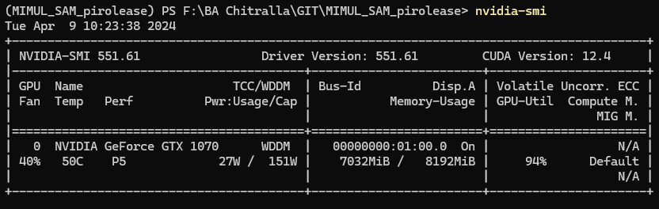

# MIMUL SAM piano roll lead segmenting

## Introduction

This implementation of the Segment Anything Model is combined from a fork of the **['Fast Segment Anything Model (FastSAM)'](https://github.com/CASIA-IVA-Lab/FastSAM)** and the **['Personalize Segment Anything Model with One Shot (PerSAM)'](https://github.com/ZrrSkywalker/Personalize-SAM)**. It is being developed in the context of a Bachelors Thesis in Digital Humanities at and with the help of the [research center Digital Organology at the Musikinstrumentenmuseum of the Universität Leipzig (MIMUL)](https://organology.uni-leipzig.de/).

Both SAM implementations are combined here for mostly automated segmenting of [piano roll](https://en.wikipedia.org/wiki/Piano_roll)  leads. (Leads is the translation of the internally used german word 'Vorspann', comparative to a title page of a book or CD). Instead of using the full Segment Anything Model FastSAM and PerSAM where choosen mainly to save ressources. 

Piano roll leads used in this project are scanned JPG pictures of approximately 3200 piano rolls currently present at the Musikinstrumentenmuseum. Despite strong efforts regarding sorting and classifying, the availlable leads remain heterogeneous in appearance and quality. Therefore only a select subset of them will be used for testing.

The goal is do segment different targets on the piano roll lead that carry information.
- content labels: hold song title, composer, performing artist(s) etc.
- licence stamps: hold information about licenses that where granted for certain piano rolls
- mimul stamps: the registration stamp used by the Musikinstrumentenmuseum during the [Tasten project](https://organology.uni-leipzig.de/index.php/forschung/tasten)

## Requirements

Get a PC with at least a NVIDIA GeForce 1060. Install the latest drivers for it. Using Geforce Experience for the installation or update will usually work best. This will most likely also install CUDA 12.4. Older CUDA versions with older drivers may result in worse perfomance. For this project it was noticed that sharing RAM with the system failed with older CUDA versions. You can test your driver and CUDA versions by running ```nvidia-smi```:



 It is advised to have your PC up to date. Install git and miniconda. Windows Terminal with Powershell is advised for windows users. Debugging can be performed with Visual Studio Code and its Python extensions.

You can follow the installation here: https://www.scivision.dev/conda-powershell-python/. Essentially you need these three commands (in Windows Terminal with Powershell, or CMD):

```bash
winget install --id=Anaconda.Miniconda3 -e

conda update conda

conda init
```
If this is the first time you are working with scripts on a Windows machine you will most likely have to allow their execution. (User Powershell or Terminal with administrative rights.):

```bash
 Set-ExecutionPolicy -ExecutionPolicy RemoteSigned
```
This setting can make your Windows more prone to malicious scripts. Additional caution is advised.

### Installation

Clone the repo and create a conda environment:

```bash
git clone https://github.com/ace280/MIMUL_SAM_pirolease.git
cd MIMUL-SAM-pirolease

conda create -n pirolease python=3.9
conda activate pirolease
```

Similar to other Segment Anything implementations, this code requires `pytorch>=1.7` and `torchvision>=0.8`. Please follow the instructions [here](https://pytorch.org/get-started/locally/) to install both PyTorch and TorchVision dependencies. Installing both PyTorch and TorchVision with CUDA support is strongly recommended.

The following pytorch installation settings are used for testing:


For your system however, another choice might be necessary. But if it is the same you can use the same insatll command: ```conda install pytorch torchvision torchaudio pytorch-cuda=12.1 -c pytorch -c nvidia```

Finally install the required python modules

```bash
pip install -r requirements.txt
```
### Preparation

Download the [model weights/checkpoints](https://speicherwolke.uni-leipzig.de/index.php/s/q7nTTdkgRpTNNoz) used for FastSam and PerSAM, the [Input and Outputs](https://speicherwolke.uni-leipzig.de/index.php/s/kweqn7QJyMK6gQt) folder, as well as the [example piano roll leads](https://speicherwolke.uni-leipzig.de/index.php/s/2MeEJ8JrwBTRxZD) folder from the authors university cloud sorage.

A bigger subset of piano roll leads (approximately 3.400 files), only sorted by manufacturer, can be requested for download.

Extract the ```weights``` folder and the ```Input and Outputs``` folder into yout MIMUL_SAM_Pirolease folder. Copy the selection of pre sorted piano roll leads into the ```Input and Output``` folder. The thorough testing of the programmes capabilities requires a rather high level of complexity for these folders. For reference check ```Common Input and Output folders.txt``` and the example folder ```[mXpID_Manufacturer Name]``` within ```Input and Output```. Most importantly, input JPG files are put into the Input folder, while the instructions on what to segment for are provided via CSV files. Essentially, the CSV files are named with the target to be segmented and the lines in that CSV are providing the IDs, modes, and mode details for each picture in that manufacturers folder. Refer to the sample files for orientation.

### A word on hardware

This project runs on NVIDIA GeForce GTX 1060 and 1070 GPUs with 6 GB to 8 GB VRAM and 16 GB to 32 GB system RAM. Better graphics cards will certainly yield better results. For SAM to run, the VRAM and system RAM will be of most importance and should not be lower than 6 GB VRAM and 16 GB system RAM. If that lower threshold is the working setting, it should be considered to only use smaller sets of about five pictures as samples to not overload the system.

## Getting started

### Perfoming a complete test run

### Calling FastSAM or PerSAM on their own