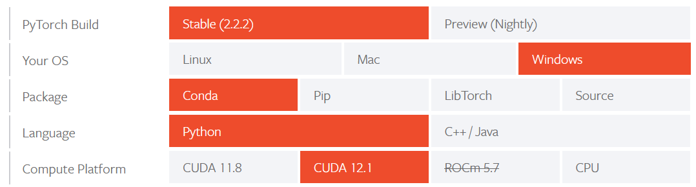

# MIMUL SAM piano roll lead segmenting

## Introduction

This implementation of the Segment Anything Model is combined from a fork of the **['Fast Segment Anything Model (FastSAM)'](https://github.com/CASIA-IVA-Lab/FastSAM)** and the **['Personalize Segment Anything Model with One Shot'](https://github.com/ZrrSkywalker/Personalize-SAM)**. It is being developed in the context of a Bachelors Thesis in Digital Humanities at and with the help of the [research center Digital Organology at the Musikinstrumentenmuseum of the Universität Leipzig (MIMUL)](https://organology.uni-leipzig.de/).

Both SAM implementations are combined here for mostly automated segmenting of [piano roll](https://en.wikipedia.org/wiki/Piano_roll)  leads. (Leads is the translation of the internally used german word 'Vorspann', comparative to a title page of a book or CD). Instead of using the full Segment Anything Model FastSAM and PerSAM where choosen mainly to save ressources. 

Piano roll leads used in this project are scanned JPG pictures of approximately 3200 piano rolls currently present at the Musikinstrumentenmuseum. Despite strong efforts regarding sorting and classifying, the availlable leads remain heterogeneous in appearance and quality. Therefore only a select subset of them will be used for testing.

The goal is do segment different targets on the piano roll lead that carry information.
- content labels: hold song title, composer, performing artist(s) etc.
- licence stamps: hold information about licenses that where granted for certain piano rolls
- mimul stamps: the registration stamp used by the Musikinstrumentenmuseum during the [Tasten project](https://organology.uni-leipzig.de/index.php/forschung/tasten)

## Requirements

### Installation

Clone the repo and create a conda environment:

```bash
git clone https://github.com/ace280/MIMUL-SAM-pirolease.git
cd MIMUL-SAM-pirolease

conda create -n pirolease python=3.9
conda activate pirolease
```

Similar to other Segment Anything implementations, this code requires `pytorch>=1.7` and `torchvision>=0.8`. Please follow the instructions [here](https://pytorch.org/get-started/locally/) to install both PyTorch and TorchVision dependencies.

This project uses the following selection for testing:



For your system however, another choice might be necessary.

Finally install the required python modules

```bash
pip install -r requirements.txt
```
### Preparation

Create the conda env. The code requires `python>=3.7`, as well as `pytorch>=1.7` and `torchvision>=0.8`. Please follow the instructions [here](https://pytorch.org/get-started/locally/) to install both PyTorch and TorchVision dependencies. Installing both PyTorch and TorchVision with CUDA support is strongly recommended.

Download the [model weights/checkpoints](https://speicherwolke.uni-leipzig.de/index.php/s/q7nTTdkgRpTNNoz) used for FastSam and PerSAM, as well as the [example piano roll leads folders](https://speicherwolke.uni-leipzig.de/index.php/s/2MeEJ8JrwBTRxZD) from the authors university cloud sorage.

A bigger subset of piano roll leads (approximately 3.400 files), only sorted by manufacturer, can be requested for download.

Unzip and move all weights/checkpoints (*.pt and *.pth files) into the 'weights' folder. Copy the selection of pre sorted piano roll leads into the ```Input and Output``` folder. For deep testing reasons that folder transpires a higher level of complexity. For reference of its structure refer to ```Common Input and Output folders.txt``` and the generic example folder ```[mXpID_Manufacturer Name]``` within ```Input and Output``` Most importantly, input JPG files are put into the Input folder, while the instructions on what to segment for are provided via the CSV file. Essentially, the name of that file also provides the name of the target to be segmented and the lines in that CSV are providing the IDs, modes, and mode details for each picture in that (manufacturers) folder. Refer to the sample files for orientation.

## Getting started

### Perfoming a complete test run

### Calling FastSAM or PerSAM on their own